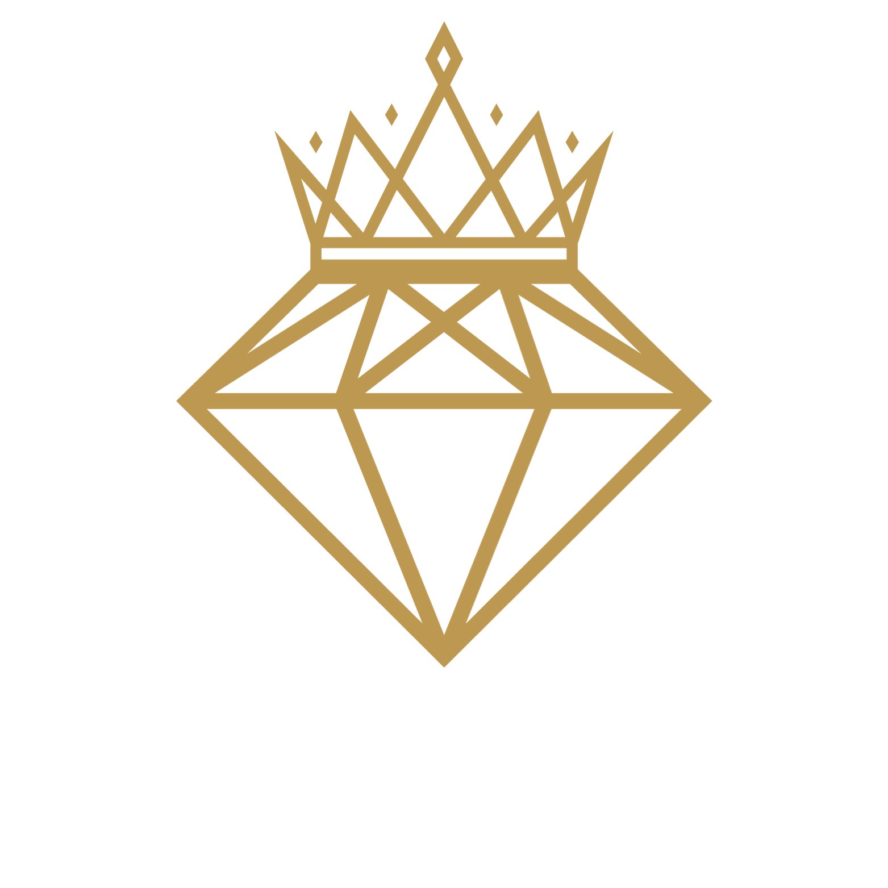

Certainly! Here's a basic README template for your gold shop website that generates custom gold necklaces with user names using HTML, CSS, and JavaScript:

# Gold Shop Necklace Generator



## Description

The Gold Shop Necklace Generator is a web application that allows users to create custom gold necklaces with their names. This application is designed for a gold shop to showcase its products and offer customers a personalized experience.

## Features

- **Customizable Name:** Users can enter their names to personalize the gold necklace.
- **Background Options:** Choose from a variety of background images for the necklace.
- **Realistic Rendering:** The generated necklace looks realistic with detailed textures.
- **Responsive Design:** The website is responsive and works well on various devices.

## Technologies Used

- HTML5
- CSS3
- JavaScript

## Getting Started

1. Clone this repository to your local machine.

```
git clone https://github.com/mqarooni/Necklace-Generator.git

npm install -g http-server
cd /path/to/your/project
http-server

```

2. Open the `index.html` file in your web browser to access the application.

## Usage

1. Enter your name in the input field.
2. Select a background image for the necklace from the sidebar.
3. Click the "Generate Image" button to create a custom gold necklace with your name.
4. The generated necklace will be displayed on the canvas.

## Contributing

Contributions are welcome! If you have any ideas for improvements or new features, please open an issue or submit a pull request.

## License

This project is licensed under the MIT License - see the [LICENSE](LICENSE) file for details.
